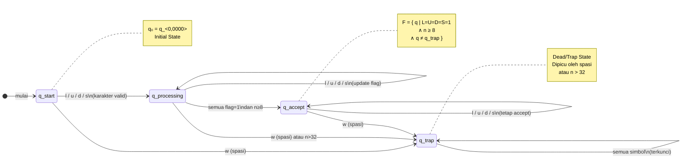

<div align="center">

# 🔐 DFA Auth — Password Validator

**Implementasi Deterministic Finite Automaton untuk Validasi & Klasifikasi Kekuatan Kata Sandi**

[](https://python.org)
[](https://flask.palletsprojects.com)
[](https://sqlite.org)
[](https://getbootstrap.com)
[](https://render.com)

<br/>

🌐 **[Lihat Aplikasi Live →](http://hasbibaihaqi-01-301240029.my.id/)**
&nbsp;&nbsp;|&nbsp;&nbsp;
🎬 **[Tonton Video Presentasi →](https://youtu.be/RTnO2ywgRSA)**

<br/>


</div>

---

## 📋 Daftar Isi

- [Deskripsi Studi Kasus](#-deskripsi-studi-kasus)
- [Jenis Otomata yang Diimplementasikan](#-jenis-otomata-yang-diimplementasikan)
  - [Definisi Formal DFA](#definisi-formal-dfa)
  - [Diagram Transisi State](#diagram-transisi-state)
  - [Fungsi Transisi δ](#fungsi-transisi-δ)
  - [Klasifikasi Kekuatan](#klasifikasi-kekuatan-password)
- [Fitur Utama](#-fitur-utama)
- [Struktur Proyek](#-struktur-proyek)
- [Cara Instalasi & Menjalankan Secara Lokal](#-cara-instalasi--menjalankan-secara-lokal)
- [Penggunaan API](#-penggunaan-api)
- [Tautan Penting](#-tautan-penting)
- [Teknologi yang Digunakan](#-teknologi-yang-digunakan)

---

## 📖 Deskripsi Studi Kasus

### Latar Belakang

Keamanan kata sandi adalah garis pertahanan pertama dalam keamanan siber. Menurut *Verizon Data Breach Investigations Report 2023*, **lebih dari 80% insiden kebocoran data** berkaitan langsung dengan kata sandi yang lemah atau bocor. Namun banyak pengguna tidak mengetahui apa yang membuat sebuah kata sandi dikategorikan "kuat".

### Permasalahan

> Bagaimana memvalidasi dan memberikan umpan balik kekuatan kata sandi secara **formal**, **transparan**, dan **edukatif** kepada pengguna?

### Solusi

Proyek ini menjawab permasalahan tersebut dengan mengimplementasikan **Deterministic Finite Automaton (DFA)** — model komputasi formal dari Teori Otomata — sebagai mesin evaluasi kata sandi. Pendekatan ini dipilih karena:

- ✅ **Formal & Matematis** — keputusan Accept/Reject dapat dibuktikan secara formal
- ✅ **Transparan** — setiap langkah transisi state dapat direkam dan divisualisasikan
- ✅ **Deterministik** — tidak ada ambiguitas dalam proses validasi
- ✅ **Edukatif** — pengguna dapat memahami *mengapa* kata sandi mereka kuat atau lemah

### Kriteria Validasi

Kata sandi dinyatakan **VALID (Accept State)** jika memenuhi **semua** syarat berikut:

| # | Syarat | Keterangan |
|---|--------|-----------|
| 1 | 📏 Panjang minimal 8 karakter | `n ≥ 8` |
| 2 | 📏 Panjang maksimal 32 karakter | `n ≤ 32` |
| 3 | 🔡 Mengandung huruf kecil | `a-z` |
| 4 | 🔠 Mengandung huruf besar | `A-Z` |
| 5 | 🔢 Mengandung angka | `0-9` |
| 6 | ✳️ Mengandung karakter khusus | `!@#$%^&*` dll |
| 7 | 🚫 Tidak mengandung spasi | Spasi → Trap State |

---

## 🤖 Jenis Otomata yang Diimplementasikan

Otomata yang digunakan adalah **Deterministic Finite Automaton (DFA)**, salah satu model komputasi paling fundamental dalam Teori Bahasa dan Automata.

### Definisi Formal

Mesin DFA pada proyek ini didefinisikan sebagai **5-tuple M = (Q, Σ, δ, q₀, F)** dengan:

```
M = (Q, Σ, δ, q₀, F)

Q  = Himpunan semua state: q_<n,LUDS> ∈ { q_<n,0000>, ..., q_<n,1111> } ∪ { q_trap }
     Total: 16 state biner (2⁴) + 1 Trap State = 17 state

Σ  = { l, u, d, s, w }
     l = huruf kecil (a-z)
     u = huruf besar (A-Z)
     d = angka (0-9)
     s = karakter khusus (!@#$...)
     w = spasi (whitespace) → memicu Trap State

δ  = Fungsi Transisi δ: Q × Σ → Q (lihat tabel di bawah)

q₀ = q_<0,0000>   (state awal, semua flag = 0, n = 0)

F  = { q | L=1 ∧ U=1 ∧ D=1 ∧ S=1 ∧ n ≥ 8 ∧ q ≠ q_trap }
     (accept state: semua 4 kelas karakter ada + panjang ≥ 8)
```

**Notasi State:**
- `q_<n, LUDS>` di mana:
  - `n` = jumlah karakter yang sudah terbaca
  - `L` = 1 jika ada huruf kecil, 0 jika belum
  - `U` = 1 jika ada huruf besar, 0 jika belum
  - `D` = 1 jika ada angka, 0 jika belum
  - `S` = 1 jika ada karakter khusus, 0 jika belum

---

### Diagram Transisi State

Diagram berikut menunjukkan alur transisi mesin DFA dari state awal hingga Accept State atau Trap State:

```
                                    ┌─────────────────────────────────────────────────────┐
                                    │              DIAGRAM TRANSISI STATE DFA              │
                                    │         M = Password Validator (Simplified)          │
                                    └─────────────────────────────────────────────────────┘

                     [l/u/d/s]               [l/u/d/s]               [l/u/d/s]
     ┌──────────┐  ─────────────►  ┌──────────┐  ─────────────►  ┌──────────┐
 ──► │q_<0,0000>│                  │q_<n,????>│                  │q_<n,?????>│  . . .
     └──────────┘                  └──────────┘                  └──────────┘
          │                             │                              │
          │ [w / n≥32]                  │ [w / n≥32]                   │ [w / n≥32]
          ▼                             ▼                              ▼
     ╔══════════╗ ◄──────────────────────────────────────────────────────────────
     ║  q_trap  ║  [semua simbol]   (Trap State: tidak bisa keluar)
     ╚══════════╝ ───────────────────────────────────────────────────────────────►

                                         . . .

     ┌─────────────┐  [l/u/d/s]   ┌════════════════╗
     │ q_<n,1110>  │ ────────────► ║ q_<n,1111>     ║  ← ACCEPT STATE (jika n ≥ 8)
     │(kurang 1 lagi)│             ║ (semua terpenuhi)║
     └─────────────┘              ╚════════════════╝
```

**Diagram lengkap perubahan flag (contoh password `Hello@1!`):**

```
   q_<0,0000>                             ← State Awal (password kosong)
       │
       │ 'H' (uppercase → U=1)
       ▼
   q_<1,0100>
       │
       │ 'e' (lowercase → L=1)
       ▼
   q_<2,1100>
       │
       │ 'l' (lowercase, L sudah 1, tidak berubah)
       ▼
   q_<3,1100>
       │
       │ 'l' (lowercase)
       ▼
   q_<4,1100>
       │
       │ 'o' (lowercase)
       ▼
   q_<5,1100>
       │
       │ '@' (special → S=1)
       ▼
   q_<6,1101>
       │
       │ '1' (digit → D=1)
       ▼
   q_<7,1111>    ← Semua flag = 1, tapi n=7 < 8, belum Accept
       │
       │ '!' (special, flag S sudah 1, tidak berubah)
       ▼
  ╔══════════╗
  ║q_<8,1111>║  ← ACCEPT STATE ✓ (n=8 ≥ 8, L=U=D=S=1)
  ╚══════════╝

  Hasil: VALID | Kekuatan: Strong
```

**Contoh Trap State (password `Hello World!`):**

```
   q_<0,0000> ──'H'──► q_<1,0100> ──'e'──► q_<2,1100> ── ... ──► q_<5,1100>
                                                                         │
                                                                         │ ' ' (SPASI!)
                                                                         ▼
                                                                   ╔══════════╗
                                                                   ║  q_trap  ║ ← REJECTED ✗
                                                                   ╚══════════╝
                                                              (tidak bisa keluar)
```

---

### Diagram Mermaid (Untuk Render di GitHub)



---

### Fungsi Transisi δ

Berikut contoh rekaman fungsi transisi δ(q, σ) untuk password `Abc1@xyz!`:

| Langkah | Input (σ) | State Asal (q) | Kelas Simbol | State Tujuan (q') |
|:-------:|:---------:|:--------------:|:------------:|:-----------------:|
| 1 | `A` | `q_<0,0000>` | uppercase (u) | `q_<1,0100>` |
| 2 | `b` | `q_<1,0100>` | lowercase (l) | `q_<2,1100>` |
| 3 | `c` | `q_<2,1100>` | lowercase (l) | `q_<3,1100>` |
| 4 | `1` | `q_<3,1100>` | digit (d) | `q_<4,1110>` |
| 5 | `@` | `q_<4,1110>` | special (s) | `q_<5,1111>` |
| 6 | `x` | `q_<5,1111>` | lowercase (l) | `q_<6,1111>` |
| 7 | `y` | `q_<6,1111>` | lowercase (l) | `q_<7,1111>` |
| 8 | `z` | `q_<7,1111>` | lowercase (l) | `q_<8,1111>` |
| 9 | `!` | `q_<8,1111>` | special (s) | **`q_<9,1111>` ✓ ACCEPT** |

> 📝 Log transisi lengkap seperti ini ditampilkan secara **real-time** di halaman aplikasi setiap kali pengguna mengetik karakter.

---

### Klasifikasi Kekuatan Password

Berdasarkan state akhir mesin DFA, sistem mengklasifikasikan kekuatan kata sandi:

| Kondisi State Akhir | Kekuatan | Status | Warna |
|---|:---:|:---:|:---:|
| q_trap (ada spasi / >32 karakter) | ❌ Rejected | Tidak Valid | 🔴 Merah |
| n < 8 atau hanya 0–1 kelas karakter | ⚡ Very Weak | Tidak Valid | 🔴 Merah |
| 2 kelas karakter terpenuhi | 🔸 Weak | Tidak Valid | 🟠 Oranye |
| 3 kelas karakter terpenuhi | 🔶 Medium | Tidak Valid | 🟡 Kuning |
| Semua 4 kelas + 8 ≤ n < 12 | 💪 Strong | **Valid ✓** | 🟢 Hijau |
| Semua 4 kelas + n ≥ 12 | 🛡️ Very Strong | **Valid ✓** | 🔵 Biru |

---

## ✨ Fitur Utama

| Fitur | Deskripsi |
|---|---|
| 🔍 **Validasi Real-time** | Password dievaluasi karakter per karakter tanpa perlu klik tombol |
| 📊 **Visualisasi State** | Diagram node state dan panah transisi yang diperbarui secara live |
| 📋 **Log Simulasi** | Tabel lengkap yang merekam setiap langkah δ(q, σ) |
| 💪 **Strength Meter** | Progress bar berwarna dinamis sesuai tingkat kekuatan |
| ✅ **Checklist Syarat** | Indikator visual untuk setiap kriteria DFA yang terpenuhi |
| 📈 **Dashboard Statistik** | Agregat data: total uji, valid/invalid, distribusi kekuatan |
| 📚 **Halaman Edukasi** | Penjelasan konsep DFA dan 5-tuple untuk pembelajaran |
| 🕶️ **Toggle Password** | Tombol show/hide untuk melihat karakter yang diketik |
| 💾 **Riwayat Validasi** | Penyimpanan riwayat (dengan masking) ke database SQLite |

---

## 📁 Struktur Proyek

```
dfa-password-validator/
│
├── 📄 app.py                   # Entry point — Application Factory Flask
├── 📄 config.py                # Konfigurasi: database URI, secret key
├── 📄 requirements.txt         # Daftar dependensi Python
├── 📄 .gitignore               # File yang diabaikan Git
│
├── 📂 controllers/             # Layer Controller (Blueprint Flask)
│   ├── __init__.py
│   ├── views.py                # Routing halaman HTML (/, /dashboard, /about)
│   └── api.py                  # REST API (/api/validate, /api/history, /api/statistics)
│
├── 📂 models/                  # Layer Model (ORM)
│   ├── __init__.py
│   └── history.py              # Model PasswordHistory (tabel SQLite)
│
├── 📂 services/                # Layer Business Logic
│   ├── __init__.py
│   ├── dfa_engine.py           # ⭐ Inti mesin DFA (kelas PasswordDFA)
│   └── validation.py           # Utilitas: fungsi masking password
│
├── 📂 utils/                   # Utilitas umum
│   ├── __init__.py
│   └── constants.py            # Konstanta aplikasi
│
├── 📂 templates/               # Template HTML (Jinja2)
│   ├── index.html              # Halaman Validator + Visualisasi DFA
│   ├── dashboard.html          # Halaman Dashboard Statistik
│   └── about.html              # Halaman Edukasi Tentang DFA
│
├── 📂 static/                  # Aset statis
│   ├── css/
│   │   ├── style.css           # CSS utama (import semua modul)
│   │   ├── layout.css          # Sidebar, wrapper, layout utama
│   │   ├── dfa.css             # Styling visualisasi DFA
│   │   ├── table.css           # Styling tabel log simulasi
│   │   ├── dashboard.css       # Styling halaman dashboard
│   │   ├── animation.css       # Animasi dan transisi
│   │   └── responsive.css      # Breakpoint responsif mobile
│   └── js/
│       ├── api.js              # Fungsi fetch ke REST API backend
│       ├── dfa_viz.js          # Render diagram visualisasi state DFA
│       ├── ui.js               # Logic antarmuka & event listeners
│       └── dashboard.js        # Logic & render data dashboard
│
├── 📂 database/
│   └── dfa_app.db              # File database SQLite
│
└── 📂 migrations/              # File migrasi Flask-Migrate (Alembic)
```

---

## 🚀 Cara Instalasi & Menjalankan Secara Lokal

### Prasyarat

Pastikan sistem Anda sudah memiliki:
- ✅ **Python 3.10+** — [Download Python](https://python.org/downloads)
- ✅ **Git** — [Download Git](https://git-scm.com/downloads)
- ✅ Koneksi internet (untuk CDN Bootstrap saat pertama kali buka browser)

---

### Langkah 1 — Clone Repository

```bash
git clone https://github.com/hasbibaihaqi/dfa-password-validator.git
cd dfa-password-validator
```

---

### Langkah 2 — Buat & Aktifkan Virtual Environment

```bash
# Buat virtual environment
python -m venv venv

# Aktifkan — Windows (PowerShell)
venv\Scripts\activate

# Aktifkan — Windows (Command Prompt)
venv\Scripts\activate.bat

# Aktifkan — macOS / Linux
source venv/bin/activate
```

> 💡 Ciri berhasil: muncul `(venv)` di awal baris command prompt/terminal.

---

### Langkah 3 — Install Dependensi

```bash
pip install -r requirements.txt
```

Dependensi yang akan terinstall:
```
Flask==3.0.3
Flask-SQLAlchemy==3.1.1
Flask-Migrate==4.0.7
gunicorn
```

---

### Langkah 4 — Jalankan Aplikasi

```bash
python app.py
```

Output yang diharapkan:
```
 * Serving Flask app 'app'
 * Debug mode: on
 * Running on http://127.0.0.1:5000
 * Press CTRL+C to quit
```

---

### Langkah 5 — Buka di Browser

Buka browser dan kunjungi:

| Halaman | URL |
|---|---|
| 🔑 Password Validator | [http://127.0.0.1:5000/](http://127.0.0.1:5000/) |
| 📊 Dashboard Statistik | [http://127.0.0.1:5000/dashboard](http://127.0.0.1:5000/dashboard) |
| 📚 Tentang DFA | [http://127.0.0.1:5000/about](http://127.0.0.1:5000/about) |

---

### Perintah Berguna Lainnya

```bash
# Menghentikan server
CTRL + C

# Deaktivasi virtual environment
deactivate

# Melihat log database (opsional)
sqlite3 database/dfa_app.db ".tables"
sqlite3 database/dfa_app.db "SELECT * FROM password_history LIMIT 10;"
```

---

## 🔌 Penggunaan API

Aplikasi menyediakan REST API yang dapat diuji menggunakan `curl`, Postman, atau Insomnia.

### `POST /api/validate` — Validasi Password

```bash
curl -X POST http://127.0.0.1:5000/api/validate \
  -H "Content-Type: application/json" \
  -d '{"password": "Hello@1234!"}'
```

**Response:**
```json
{
  "is_valid": true,
  "final_state": "q_<10,1111>",
  "strength": "Very Strong",
  "rules_passed": 4,
  "length": 10,
  "checklist": {
    "min_length": true,
    "max_length": true,
    "has_lower": true,
    "has_upper": true,
    "has_digit": true,
    "has_special": true,
    "no_space": true
  },
  "steps": [
    { "char": "H", "from_state": "q_<0,0000>", "to_state": "q_<1,0100>" },
    { "char": "e", "from_state": "q_<1,0100>", "to_state": "q_<2,1100>" },
    "..."
  ]
}
```

### `GET /api/history` — Riwayat Validasi

```bash
curl http://127.0.0.1:5000/api/history
```

### `GET /api/statistics` — Statistik

```bash
curl http://127.0.0.1:5000/api/statistics
```

### `DELETE /api/history` — Hapus Riwayat

```bash
curl -X DELETE http://127.0.0.1:5000/api/history
```

---

## 🔗 Tautan Penting

| 🔗 | Deskripsi | Link |
|---|---|---|
| 🌐 | **Aplikasi Live (Render.com)** | http://hasbibaihaqi-01-301240029.my.id/ |
| 🎬 | **Video Presentasi** | https://youtu.be/RTnO2ywgRSA |
| 💻 | **Repository GitHub** | [https://github.com/hasbibaihaqi/dfa-password-validator](https://github.com/hasbibaihaqi/dfa-password-validator) |

> ⚠️ **Catatan:** Aplikasi di-host di Render.com dengan paket gratis. Server mungkin membutuhkan waktu **~30 detik** untuk *spin up* setelah periode tidak aktif.

---

## 🛠️ Teknologi yang Digunakan

### Back-End
| Teknologi | Versi | Fungsi |
|---|---|---|
| Python | 3.10+ | Bahasa pemrograman utama |
| Flask | 3.0.3 | Web framework micro |
| Flask-SQLAlchemy | 3.1.1 | ORM untuk database |
| Flask-Migrate | 4.0.7 | Manajemen migrasi database |
| SQLite | Bawaan Python | Database penyimpanan riwayat |
| Gunicorn | Latest | WSGI server untuk production |

### Front-End
| Teknologi | Versi | Fungsi |
|---|---|---|
| HTML5 | Standard | Struktur halaman |
| CSS3 (Vanilla) | Standard | Styling kustom modular |
| JavaScript | ES6+ | Logic interaktif real-time |
| Bootstrap | 5.3.0 | Framework CSS responsif |
| Bootstrap Icons | 1.11.3 | Ikon vektor |

### DevOps & Tools
| Teknologi | Fungsi |
|---|---|
| Git & GitHub | Version control & hosting kode |
| Render.com | Platform deployment cloud |
| VS Code | Code editor |
| Python venv | Isolasi dependensi |

---

## 👤 Penulis

**Hasbib Aihaqi**
- GitHub: [@hasbibaihaqi](https://github.com/hasbibaihaqi)

---

## 📄 Lisensi

Proyek ini dibuat untuk keperluan akademis.

---

<div align="center">

**⭐ Jika proyek ini bermanfaat, berikan bintang di GitHub! ⭐**

*Dibuat dengan ❤️ menggunakan Python & Flask — Teori Otomata dalam Aksi*

</div>
